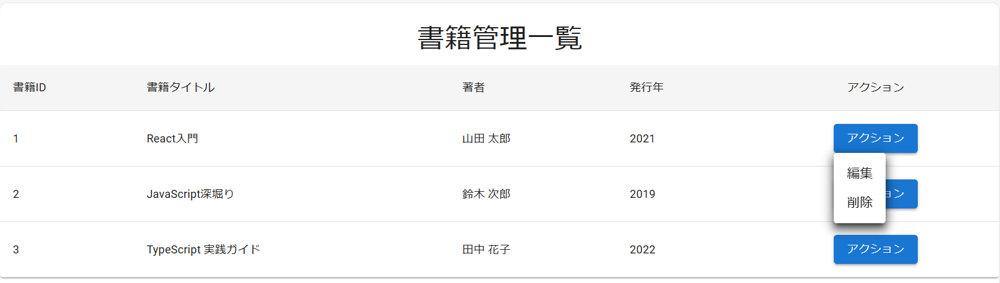

# ReactSample

React.js, Redux, MUIを使って簡単な画面をお試しで作成

## 環境構築時のコマンド

1. React.jsのプロジェクトを作成するコマンド

> npx create-react-app my-app

2. 必要なパッケージのインストール

> npm install react react-dom @mui/material @emotion/react @emotion/styled redux react-redux react-router-dom

## 編集したソース
index.js ：Routesの設定を記載  
TestPage.js ： 画面表示用の処理  

## 画面表示結果

* 初期表示
  

* アクションボタン押下時
  

